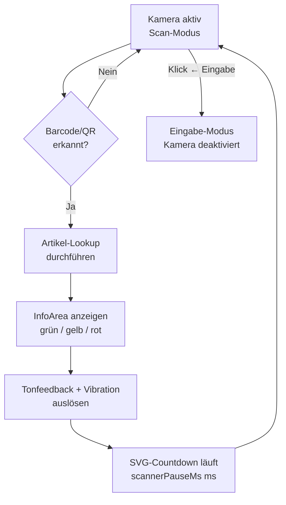

# Story: Inline-Kamera-Scanner mit Countdown-Feedback

## Ziel

Als Kassenpersonal kann ich im Inline-Kamera-Modus Barcodes kontinuierlich scannen, ohne
ein Modal zu öffnen, weil nach jedem Scan ein Countdown das Ergebnis anzeigt und die
Kamera danach automatisch neu startet.

## Kontext

Der Inline-Modus ersetzt das Eingabefeld **an seiner Position** durch ein Live-Kamerabild —
alle Bereiche darunter bleiben sichtbar. Gedacht für Abläufe, in denen mehrere Artikel
nacheinander gescannt werden, ohne jedes Mal ein Modal zu öffnen und zu schließen.

**Einsatzstellen:** Artikel-Freigeben-Popup ([Epic_Verkaeufer](../../Epic_Verkaeufer/epic.md)
Abschnitt 5) und Rückgabe-Popup ([Epic_Abrechnung](../../Epic_Abrechnung/epic.md)) — beide
über den [Scan-Dialog](../../../../../components/scan-dialog/component.md). Der zweite
Scanner-Modus (Popup, schließt nach einem Treffer) ist in
[VERKAUF-S01](../../Epic_Verkauf/stories/VERKAUF-S01-popup-camera-mode.md) beschrieben.

Die Kamera selbst liefert die Komponente
[Barcode-Scanner](../../../../../components/barcode-scanner/component.md) — sie kennt
weder Artikel noch Feedback; Lookup, Farben, Ton und Countdown gehören hierher.

Die Anzeigedauer des Scan-Ergebnisses ist über `scannerPauseMs` konfigurierbar
([`spec.md`](../../../spec.md) Abschnitt 8; Default 3 000 ms).

## Scope

**In Scope:** Inline-Kamera-Ansicht, Artikel-Lookup je erkanntem Code, InfoArea-Feedback
in drei Farben, Ton und Vibration, SVG-Countdown, automatischer Neustart des Scans,
Rückkehr in den Eingabe-Modus, Freigabe der Kamera.

**Out of Scope:** Der Zeitstempel, der beim Treffer gesetzt wird (`targetField` des
Scan-Dialogs), das umgebende Popup, der Popup-Scanner-Modus (VERKAUF-S01).

## UI-Spezifikation

### Inline-Kamera-Modus (Scan läuft)

```
┌─────────────────────────────────────┐
│ ╔═════════════════════════════════╗ │
│ ║   [Live-Kamerabild             ]║ │
│ ║   [  + Scan-Rahmen             ]║ │ ← AC-1
│ ╚═════════════════════════════════╝ │
│  [ ← Eingabe ]                      │ ← AC-5
└─────────────────────────────────────┘
  Bereiche unterhalb des Kamerafensters bleiben sichtbar (AC-1)
```

### Nach Scan: Ergebnis-Anzeige mit Countdown

```
┌─────────────────────────────────────┐
│ ╔═════════════════════════════════╗ │
│ ║  [✓] Artikel 12345 — 12,00 €   ║ │ ← InfoArea grün (AC-2)
│ ║      + Ping-Ton + Vibration     ║ │ ← AC-3
│ ║                                 ║ │
│ ║        ╭───────────╮            ║ │
│ ║        │  ████ 2s  │  SVG-Ring  ║ │ ← Countdown (AC-4)
│ ║        ╰───────────╯            ║ │
│ ╚═════════════════════════════════╝ │
│  [ ← Eingabe ]                      │ ← AC-5
└─────────────────────────────────────┘
  Nach Ablauf des Countdowns → Kamerabild erscheint wieder (AC-4)
```

### Feedback-Fälle

| Ergebnis | Farbe | Beispieltext |
|---|---|---|
| Artikel gefunden, Zeitstempel gesetzt | 🟢 grün | „Artikel 12345 — 12,00 €" |
| Zeitstempel war bereits gesetzt | 🟡 gelb | „Artikel 12345 bereits erfasst" |
| Artikel unbekannt oder falscher Status | 🔴 rot | „Artikel nicht bekannt" |

### Ablauf nach Scan



## Akzeptanzkriterien

- [ ] **AC-1** — WHILE der Inline-Kamera-Modus aktiv ist, SHALL das System das Kamerafenster an der Position des Eingabefeldes einblenden und alle Bereiche unterhalb des Kamerafensters sichtbar lassen.
- [ ] **AC-2** — WHEN ein Barcode oder QR-Code erkannt wird, THEN SHALL das System einen Artikel-Lookup durchführen und das Ergebnis in der InfoArea anzeigen (grün bei Erfolg, gelb bei bereits gesetztem Zeitstempel, rot bei unbekanntem Artikel oder falschem Status).
- [ ] **AC-3** — WHEN ein Scan-Ergebnis vorliegt, THEN SHALL das System ein akustisches Feedback ausgeben (Ping 880→1320 Hz bei Erfolg / Zonk 180→120 Hz bei Fehler, Web Audio API) und, sofern `Navigator.vibrate()` verfügbar ist, eine Vibration auslösen.
- [ ] **AC-4** — WHEN das Scan-Ergebnis angezeigt wird, THEN SHALL das System einen kreisförmigen SVG-Countdown über `scannerPauseMs` Millisekunden (Default 3 000 ms) einblenden und nach dessen Ablauf das Kamerabild ohne weiteren Nutzereingriff wieder aktivieren.
- [ ] **AC-5** — WHEN der „← Eingabe"-Button geklickt wird, THEN SHALL das System jederzeit in den Eingabe-Modus wechseln und die Kamera deaktivieren.
- [ ] **AC-6** — IF die Kamera nicht verfügbar oder der Zugriff verweigert wird, THEN SHALL das System eine rote InfoArea mit dem Text „Kamerazugriff nicht möglich" anzeigen und in den Eingabe-Modus wechseln.
- [ ] **AC-7** — WHILE ein Scan-Ergebnis angezeigt wird, SHALL das System weitere erkannte Codes verwerfen — derselbe Code darf nicht mehrfach verarbeitet werden, obwohl der Scan-Loop weiterläuft.
- [ ] **AC-8** — WHEN der Inline-Modus verlassen oder das umgebende Popup geschlossen wird, THEN SHALL das System `active=false` setzen, sodass die Scanner-Komponente alle MediaStream-Tracks freigibt.
- [ ] **AC-9** — THE SYSTEM SHALL `scannerPauseMs` aus den Einstellungen lesen und nicht als Konstante im Code führen.

## Abhängigkeiten

| Abhängigkeit | Grund |
|---|---|
| [Barcode-Scanner](../../../../../components/barcode-scanner/component.md) | Videobild und `codeDetected` |
| [Scan-Dialog](../../../../../components/scan-dialog/component.md) | Umgebendes Popup, liefert über `targetField` den zu setzenden Zeitstempel |
| [`entities/artikel.md`](../../../entities/artikel.md) | Statuszeitstempel, gegen die der Lookup prüft |

## Tags & Piles

**Piles:** #pile/bazaar-app
**Tags:** #kamera #scanner #inline-modus #countdown #tonfeedback #barcode #scan-feedback
