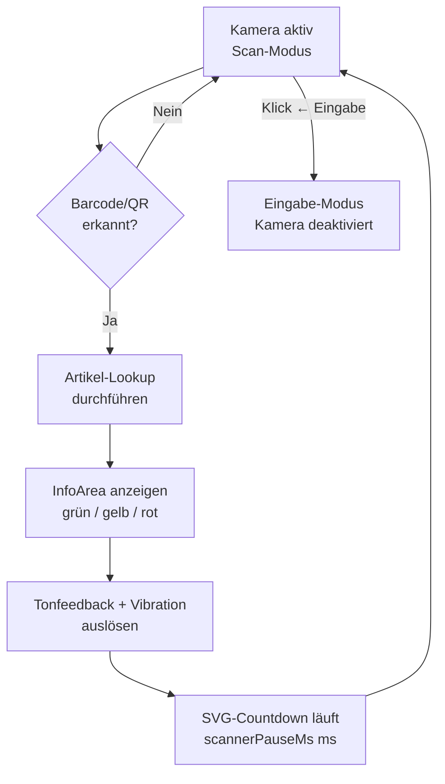

# Story: Inline-Kamera-Scanner mit Countdown-Feedback

## Ziel
Als Kassenpersonal kann ich im Inline-Kamera-Modus Barcodes kontinuierlich scannen, ohne ein Modal zu öffnen, weil nach jedem Scan ein Countdown das Ergebnis anzeigt und die Kamera danach automatisch neu startet.

## Kontext
Der Inline-Modus (Abschnitt 6.4) ersetzt das Eingabefeld an seiner Position durch ein Live-Kamerabild — das Popup oder der Bereich darunter bleibt vollständig sichtbar. Dieser Modus ist für Arbeitsabläufe gedacht, in denen mehrere Artikel nacheinander gescannt werden, ohne jedes Mal ein Modal zu öffnen und zu schließen.

Einsatz-Kontexte laut Anforderungen: Artikel-Freigeben-Popup (Feature Verkäufer) und Rückgabe-Popup (Feature Abrechnung).

Die Anzeigedauer des Scan-Ergebnisses ist über `scannerPauseMs` konfigurierbar (Einstellungen, Abschnitt 8; Default: 3 000 ms).

## UI-Spezifikation

### Inline-Kamera-Modus (Scan läuft)

```
┌─────────────────────────────────────┐
│ ╔═════════════════════════════════╗ │
│ ║   [Live-Kamerabild             ]║ │
│ ║   [  + Scan-Rahmen             ]║ │ ← AC-1
│ ╚═════════════════════════════════╝ │
│  [ ← Eingabe ]                      │ ← AC-5
└─────────────────────────────────────┘
  Bereiche unterhalb des Kamerafensters bleiben sichtbar (AC-1)
```

### Nach Scan: Ergebnis-Anzeige mit Countdown

```
┌─────────────────────────────────────┐
│ ╔═════════════════════════════════╗ │
│ ║  [✓] Artikel 12345 — 12,00 €   ║ │ ← InfoArea grün (AC-2)
│ ║      + Ping-Ton + Vibration     ║ │ ← AC-3
│ ║                                 ║ │
│ ║        ╭───────────╮            ║ │
│ ║        │  ████ 2s  │  SVG-Ring  ║ │ ← Countdown (AC-4)
│ ║        ╰───────────╯            ║ │
│ ╚═════════════════════════════════╝ │
│  [ ← Eingabe ]                      │ ← AC-5
└─────────────────────────────────────┘
  Nach Ablauf des Countdowns → Kamerabild erscheint wieder (AC-4)
```

### Ablauf nach Scan



## Akzeptanzkriterien

- [ ] **AC-1** — WHILE der Inline-Kamera-Modus aktiv ist, SHALL das System das Kamerafenster an der Position des Eingabefeldes einblenden und alle Bereiche unterhalb des Kamerafensters sichtbar lassen.
- [ ] **AC-2** — WHEN ein Barcode oder QR-Code erkannt wird, THEN SHALL das System einen Artikel-Lookup durchführen und das Ergebnis in der InfoArea anzeigen (grün bei Erfolg, rot bei unbekanntem Artikel oder falschem Status, gelb als Warnung).
- [ ] **AC-3** — WHEN ein Scan-Ergebnis vorliegt, THEN SHALL das System ein akustisches Feedback ausgeben (Ping 880→1320 Hz bei Erfolg / Zonk 180→120 Hz bei Fehler, Web Audio API) und, sofern `Navigator.vibrate()` verfügbar ist, eine Vibration auslösen.
- [ ] **AC-4** — WHEN das Scan-Ergebnis angezeigt wird, THEN SHALL das System einen kreisförmigen SVG-Countdown über `scannerPauseMs` Millisekunden (Default 3 000 ms) einblenden und nach dessen Ablauf das Kamerabild ohne weiteren Nutzereingriff wieder aktivieren.
- [ ] **AC-5** — WHEN der „← Eingabe"-Button geklickt wird, THEN SHALL das System jederzeit in den Eingabe-Modus wechseln und die Kamera deaktivieren.
- [ ] **AC-6** — IF die Kamera nicht verfügbar oder der Zugriff verweigert wird, THEN SHALL das System eine rote InfoArea mit dem Text „Kamerazugriff nicht möglich" anzeigen und in den Eingabe-Modus wechseln.

## Tags & Piles

**Tags:** #kamera #scanner #inline-modus #countdown #tonfeedback #barcode #scan-feedback
